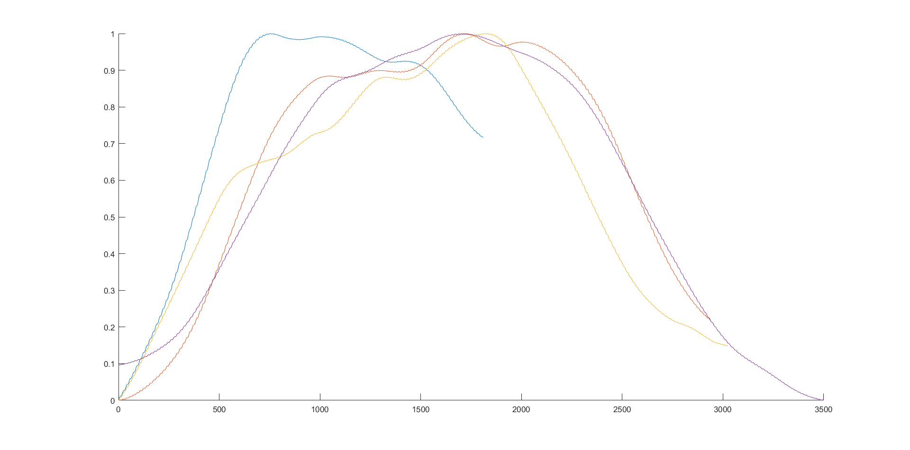
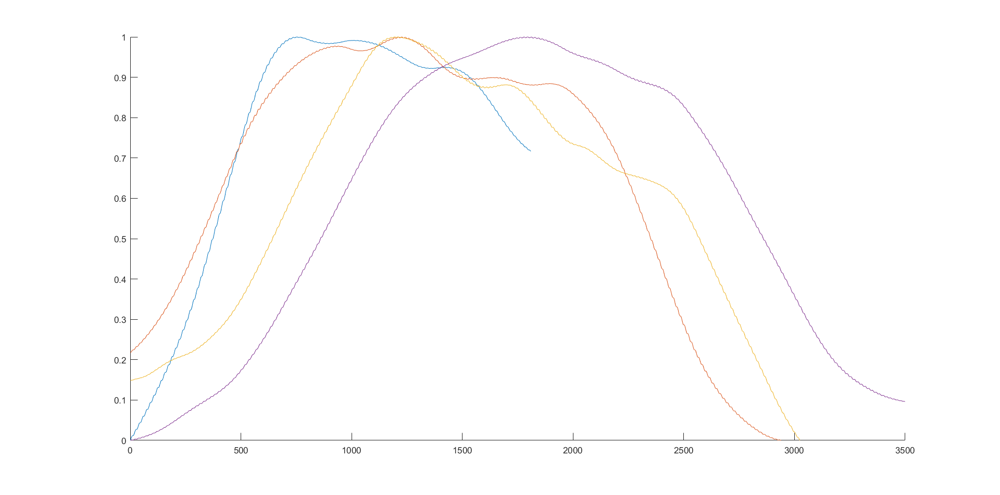

# усреднение пакета сигналов
Возьмем для примера 9 сигналов 1-го типа, выделенных человеком.
Сигналы представлены как ряды a(t) разной длины (рис.1)

*Рис. 1 Набор сигналов*  
Затем сигналы нормализуются (рис. 2) для лучшего действия корреляционных методов

*Рис. 2. Нормализованные сигналы*  
Затем для того, чтобы расположить сигналы относительно друг друга по горизонтали, вычисляется cross-correlation каждого сигнала относительно всех других. С помощью этой функции вычисляются сдвиги сигналов относительно друг друга, такие, чтобы значение функции cross-correlation было максимальным.
Таким образом, мы можем "выровнять" (сместить так, чтобы корреляция была максимальной) сигналы относительно одного произвольно выбранного.
|1|2|
|---|---|
|||
|||

Как видно из таблицы, при таком подходе итоговое расположение синалов сильно зависит от выбранного "эталонного" сигнала. Красным обозначено стандартное отклонение при усреднении, площадь красной зоны тоже сильно отличасется.

Другой вариант - сместить каждый сигнал в сторону всех других с весом, соответствнным корреляции, достигаемой от смещения. В данном случае "площадь" стандартного отклонения получается больше, чем в лучшем случае предидущего метода, но данный подход более общий. Результат на рис. 3.

*Рис. 3. Усреднение общее*
### Учет "направления" сигналов
При рассмотрении имеющихся сигналов от поездов, выделенных экспертом, можно заметьить, что некоторые сигналы как будто отражены вертикально, относительно других. Это легко объяснить тем, что поезда идут в 2 стороны. Например на рис. 4 видно, что один из сигналов ("синий") зеркален по отношению к другим.

*Рис. 4. Зеркальный сигал*  
Для учета этого свойства сигналов, считаются наилучшие усреднения сигналов для всех комбинаций отраженных сигналов, и выбирается та комбинация, для которой площадь стандартного отклонения наименьшая.

*Рис. 5. Наилучшая комбинация отражений сигналов* 
Как видно на рис. 5, "синий" сигнал был отражен.  
Подсчет корреляций для всех комбинаций отражений вычислительно очень сложен (для n сигналов это 2^n вычислений наилучшего усреднения, при том, что каждое такое вычисление требует n^2 вызовов xcorr). Поэтому если требуется усреднить больше 8-ми сигналов, наилучшая комбинация отражений вычисляется для первых 8-ми сигналов (256 усреднений), затем все остальные сигналы "выравниваются" по полученному усреднению первых 8-ми отраженных сигналов. Т. е отражаются в случае увеличения корреляции с усреднением наилучших отражений при отражении. Далее нужным образом "отраженный" набор сигналов подвергается усреднению, описанному выше.