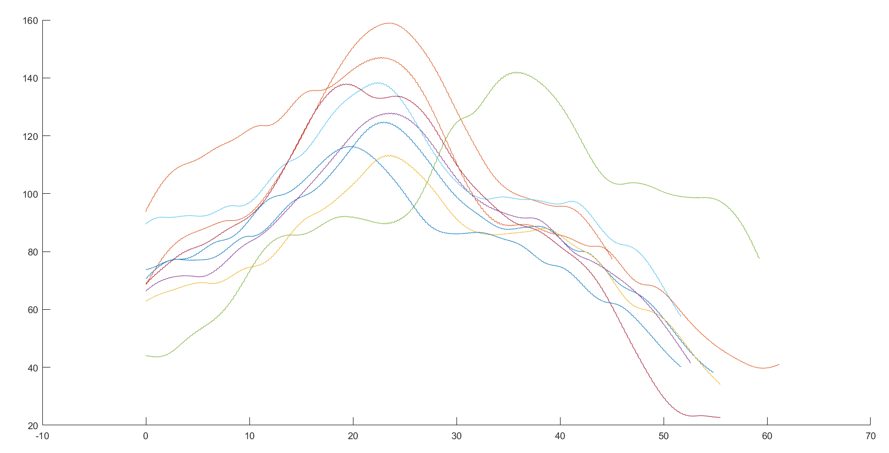
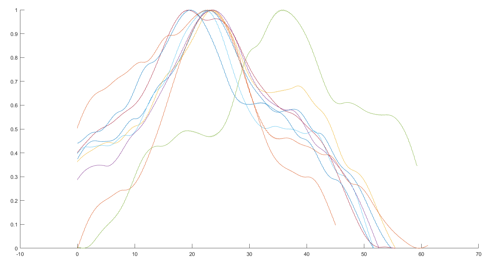
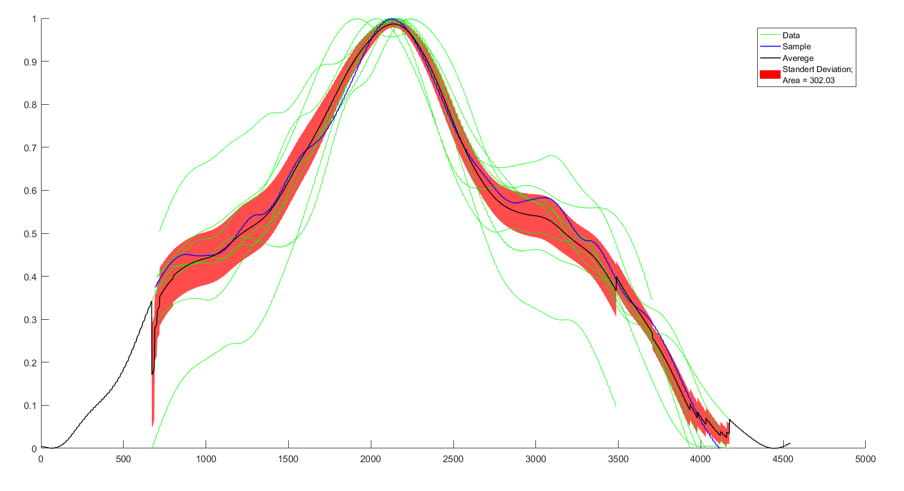
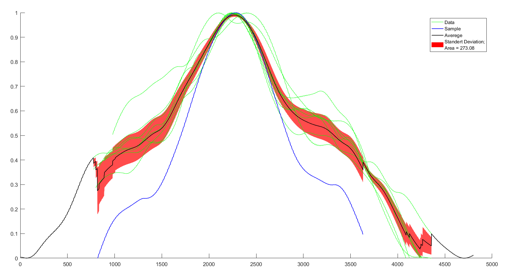
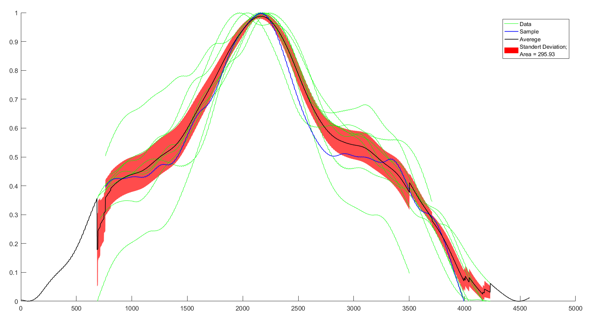
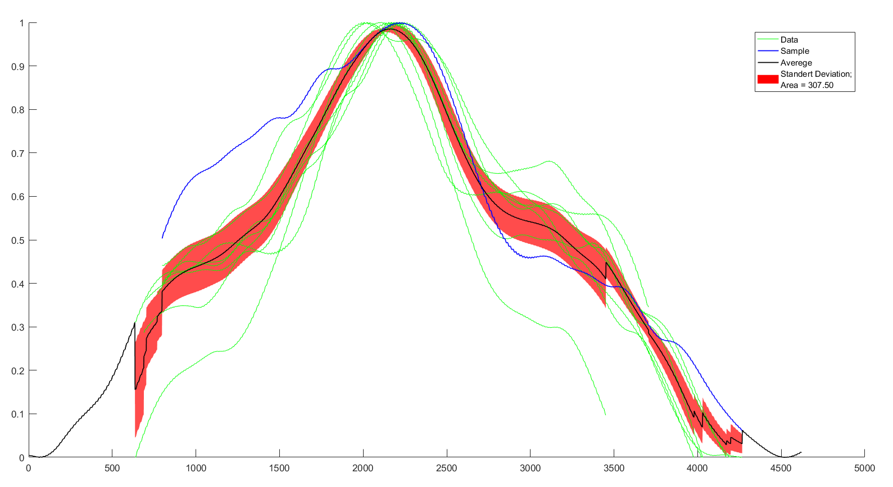
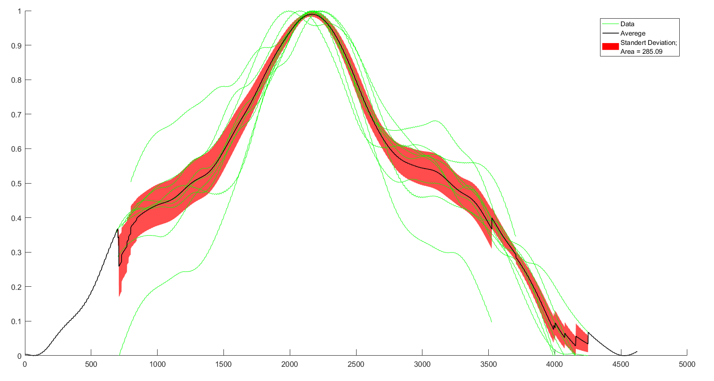

# усреднение пакета сигналов
Возьмем для примера 9 сигналов 1-го типа, выделенных человеком.
Сигналы представлены как ряды a(t) разной длины (рис.1)

*Рис. 1 Набор сигналов*
Затем сигналы нормализуются (рис. 2) для лучшего действия корреляционных методов

*Рис. 2. Нормализованные сигналы*
Затем для того, чтобы расположить сигналы относительно друг друга по горизонтали, вычисляется cross-correlation каждого сигнала относительно всех других. С помощью этой функции вычисляются сдвиги сигналов относительно друг друга, такие, чтобы значение функции cross-correlation было максимальным.
Таким образом, мы можем "выровнять" (сместить так, чтобы корреляция была максимальной) сигналы относительно одного произвольно выбранного.
|1|2|
|---|---|
|||
|||

Как видно из таблицы, при таком подходе итоговое расположение синалов сильно зависит от выбранного "эталонного" сигнала. Красным обозначено стандартное отклонение при усреднении, площадь красной зоны тоже сильно отличасется.

Другой вариант - сместить каждый сигнал в сторону всех других с весом, соответствнным корреляции, достигаемой от смещения. В данном случае "площадь" стандартного отклонения получается больше, чем в лучшем случае предидущего метода, но данный подход более общий. Результат на рис. 3.

*Рис. 3. Усреднение общее*