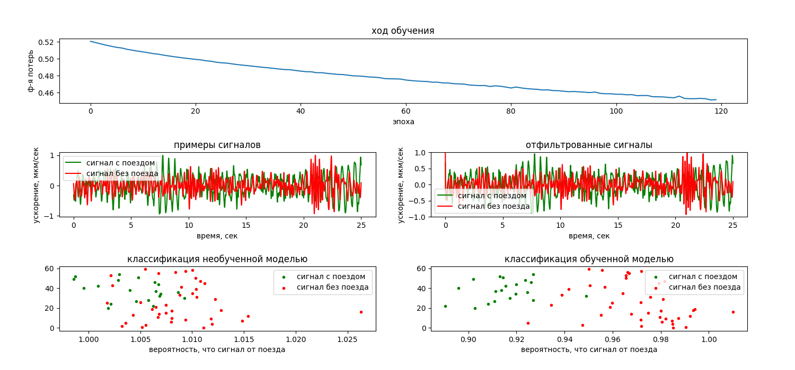
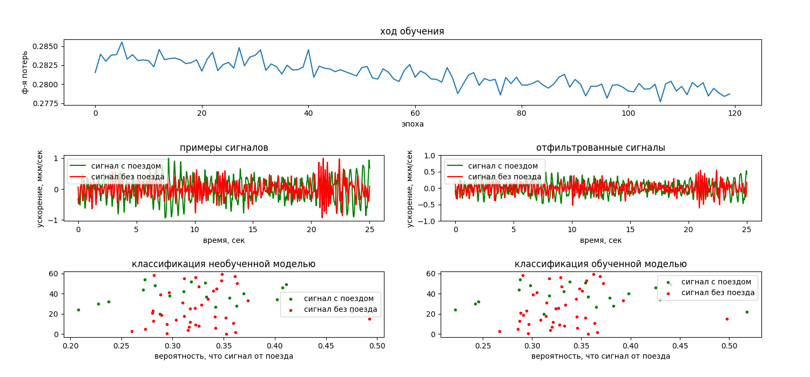

# Обучение простых перцептронов на малом наборе данных

Для выявления наиболее подходящей архитектуры нейросети и наилучшего метода
оптимизации, разные архитектуры и оптимизации протестированы на небольшом наборе обучающих данных 
(61 положительный и 65 отрицательных примеров). 

**Без рандомизации начальных значений**

|оптимизатор|фильтр|фильтр со смещениями|слой нейронов|
|-----------|------|---|---|
|Adadelta   |	|	|	|
|Adagrad    |	|	|	|
|Adam       |		|		|		|
|Adamax     |	|		|		|
|Ftrl       |		|		|		|
|Nadam      |		|		|		|
|RMSprop    |	|	|	|
|SGD        |		|		|		|

**Со случайными начальными значниями начальных значений**

|оптимизатор|фильтр|фильтр со смещениями|слой нейронов|
|-----------|------|---|---|
|Adadelta   |	|	|	|
|Adagrad    |		|	|	|
|Adam       |			|		|		|
|Adamax     |		|	|	|
|Ftrl       |		|		|		|
|Nadam      |		|		|		|
|RMSprop    |		|	|	|
|SGD        |			|		|		|