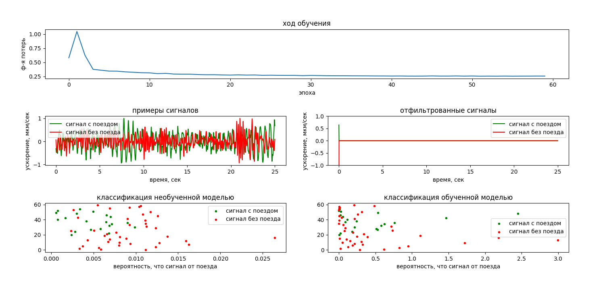
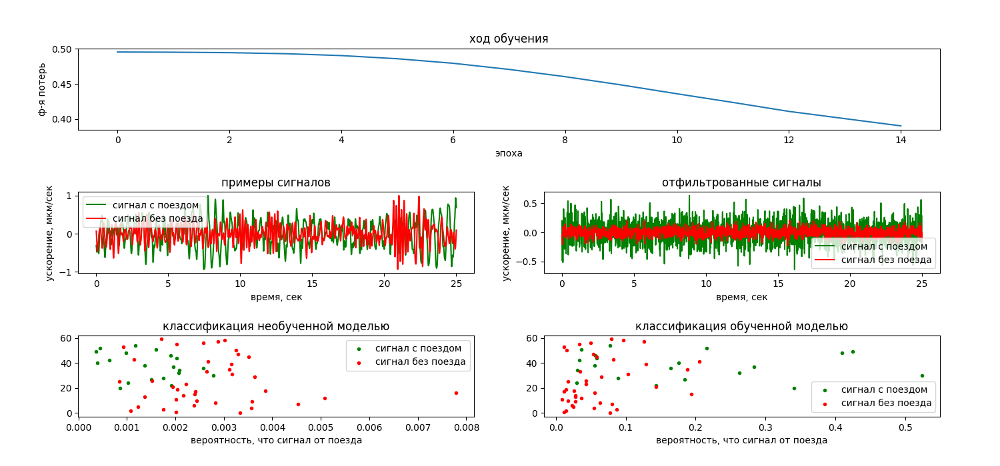
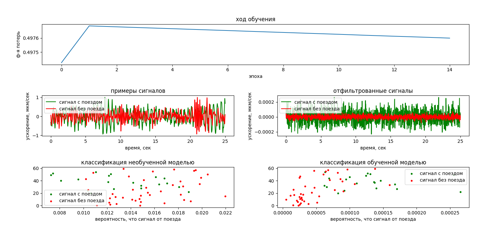

# Обучение простых перцептронов на малом наборе данных

Для выявления наиболее подходящей архитектуры нейросети и наилучшего метода
оптимизации, разные архитектуры и оптимизации протестированы на небольшом наборе обучающих данных 
(61 положительных и 65 отрицательных примеров). 

**Без рандомизации начальных значений**

|оптимизатор|фильтр|фильтр со смещениями|слой нейронов|
|-----------|------|--------------------|-------------|
|Adadelta   |	|	|	|
|Adagrad    |	|	|	|
|Adam       |		|		|		|
|Adamax     |	|		|		|
|Ftrl       |		|		|		|
|Nadam      |		|		|		|
|RMSprop    |	|	|	|
|SGD        |		|		|		|

Как и следовало ожидать, модель "слой нейронов" не обучается, когда начальные веса связей не случайны

**Со случайными начальными значениями**

|оптимизатор|фильтр|фильтр со смещениями|слой нейронов|
|-----------|------|--------------------|-------------|
|Adadelta   |	|	|	|
|Adagrad    |		|	|	|
|Adam       |			|		|		|
|Adamax     |		|	|	|
|Ftrl       |		|		|		|
|Nadam      |		|		|		|
|RMSprop    |		|	|	|
|SGD        |			|		|		|

Со случайными начальными значениями весов "слой нейронов" обучается, но 126 примеров явно не хватает.

Для обучения более сложных нейросетей нужен больший набор примеров (756 положительных и 763 отрицательных). 
Далее тесты для моделей с большим количеством связей.

|оптимизатор|слой нейронов|слой нейронов STD|1 скрытый слой|
|-----------|-------------|-----------------|--------------|
|Adadelta   |	|	|	|
|Adagrad    |	|	|	|
|Adam       |		|		|		|
|Adamax     |	|	|	|
|Ftrl       |		|		|		|
|Nadam      |	|		|	|
|RMSprop    |	|	|	|
|SGD        |		|		|		|

Видно, что "слой нейронов" и "слой нейронов STD" дают схожие результаты, так что модель "слой нейронов STD"
можно не использовать

Кол-во входных значений: 1562
Время обучения на intel Core i7-4510U 2.0GHz, 8 потоков, 8 Gb ОЗУ:

|модель|кол-во обучаемых значений|кол-во примеров|время|
|------|-------------------------|---------------|-----|
|фильтр			|1562		|126	|33.9 	+- 0.8 мс.|
|фильтр с весами|3124		|126	|37.5 	+- 5.0 мс.|
|слой нейронов	|2441406	|126	|619.1	+- 513.9 мс.|
|слой нейронов	|2441406	|1519	|6639.1 +- 505.5 мс.|
|1 скрытый слой	|3254687	|1519	|9899.2 +- 464.5 мс.|

По рассмотрении результатов тестов, для обучения на большом наборе примеров имеет смысл взять следующие модели 
и оптимизаторы

|модель|оптимизаторы|
|---|---|
|фильтр без рандомизации|Adadelta, Adagrad, SGD|
|слой нейронов|Adam, Adamax, Ftlr, Nadam, RMSprop|
|1 скрытый слой|Adam, Adamax, RMSprop|
